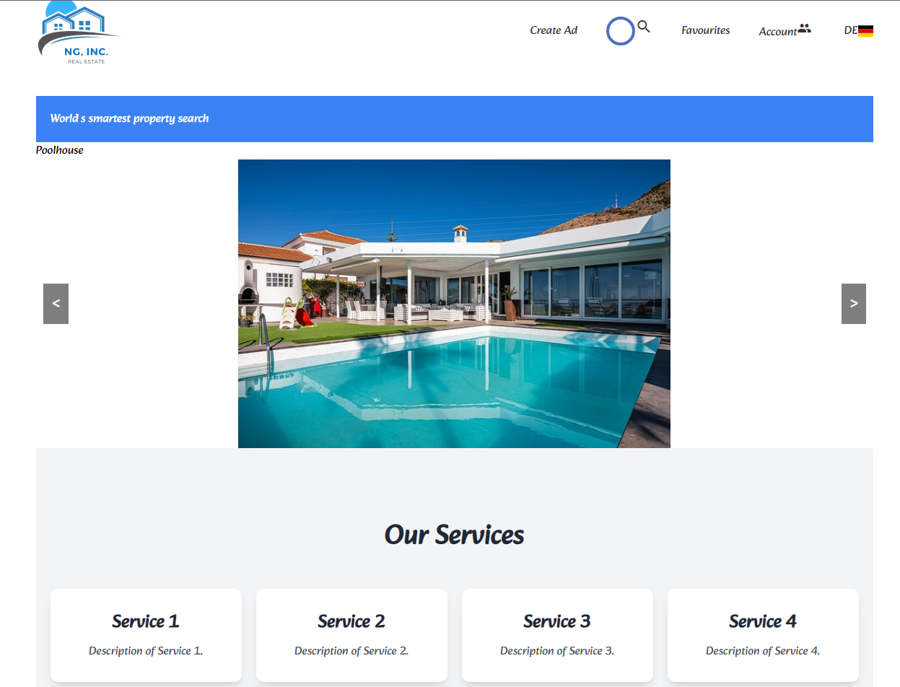

# This is a Real Estate App *** Made with Angular

1. Look for real estates using the Searchbox
2. List real estates grid view
3. Show a real estate details 

## Reactive Forms
### We Are going to use Reactive forms instead of Template driven as they:
1. Provide direct, explicit access to the underlying form's object model.
2. Compared to template-driven forms, they are more robust: they're more scalable, reusable, and testable. 
3. If forms are a key part of your application, or you're already using reactive patterns for building your application, use reactive forms.

# TO DO
1. Design app: add pages and components, style navbar an main section
2. Use reactive form to search for real estates
3. Create (get) Models: Show results (list) and results details (ge /:id)
4. Measure performance lazy loading etc..
5. E2E-, unit and integrity Tests
5. Deployment